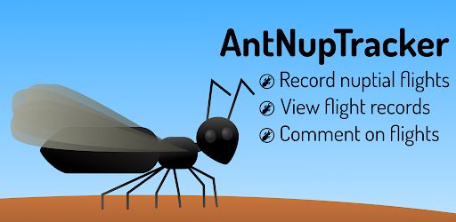

# AntNupTracker

Client app for AntNupTracker for iOS and Android™, developed using the Flutter™ framework in Dart™.

Copyright (C) 2020-2022 Abouheif Lab

Welcome to the repository for the `AntNupTracker` app. A contribution guide is coming shortly. The code is designed to try to follow Dart and Flutter style.

This app is a tool for browsing records of [ant nuptial flights](https://www.antnuptialflights.com/about/) and reporting new flights from the field. Visit our website at https://www.antnuptialflights.com for more details. For the server-side application that manages the database of ant nuptial flights, please go to [this repository](https://github.com/bzrudski/antnuptracker-server/).

Our app is licensed under the GNU GPLv3 with App Store Exception (see `COPYING`). Therefore, the app is open source, but the binary can still be distributed through Apple's App Store and Google Play without violating their terms. (All source files say GPL, but the App Store Exception is applied to all files in this project in order to not defeat the purpose of this project.)

In order to build, clone this repository and open it in an IDE. You may need to tweak a few settings. If you would like to test your modifications against a custom version of the backend, make sure that you change the `base` argument value in `url_manager.dart`.

IOS is a trademark or registered trademark of Cisco in the U.S. and other countries.

App Store and Xcode are trademarks of Apple Inc., registered in the U.S. and other countries.

Android™ and Google Play are registered trademarks of Google LLC.

Dart and the related logo are trademarks of Google LLC. We are not endorsed by or affiliated with Google LLC.

Flutter and the related logo are trademarks of Google LLC. We are not endorsed by or affiliated with Google LLC.